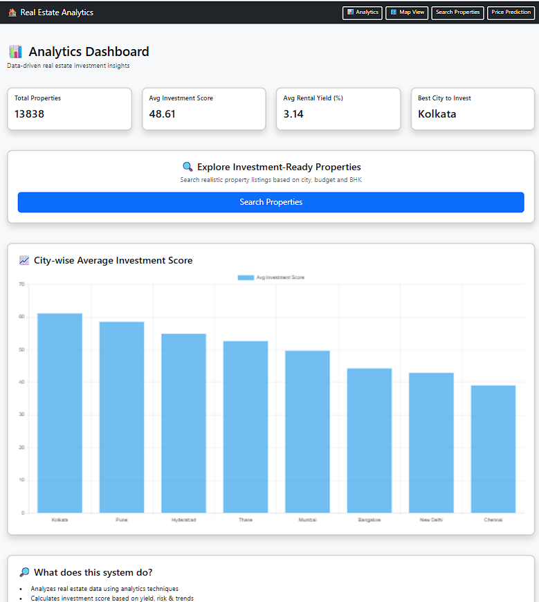
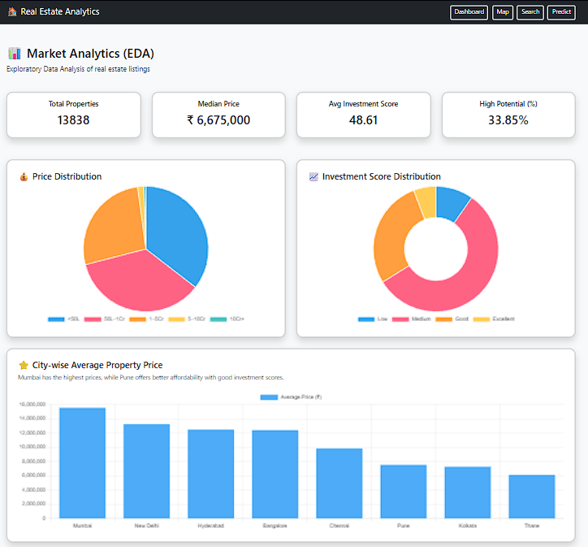
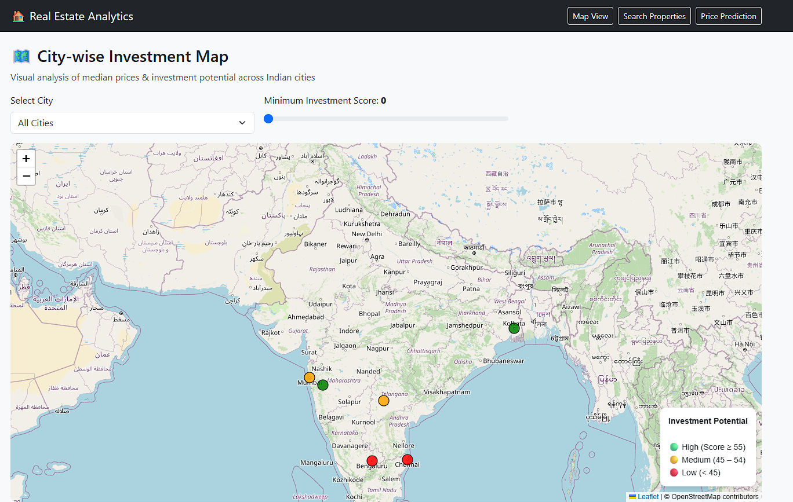
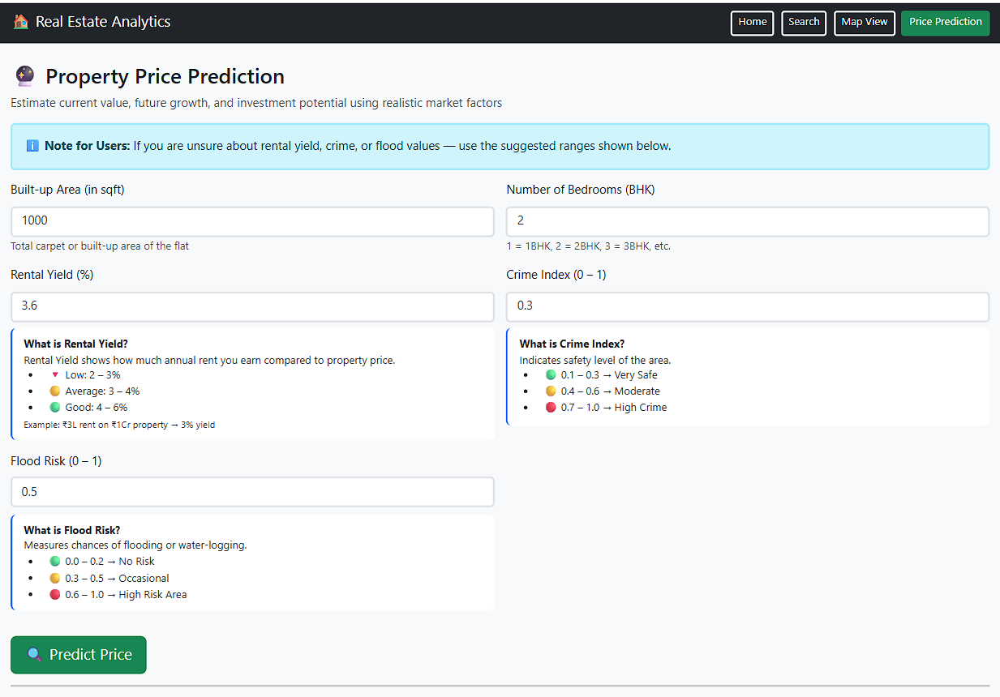

# 🏡 Real Estate Investment Analytics & ML Prediction System

A **data-driven analytics and machine learning project** that helps evaluate real estate investment opportunities using **EDA, feature engineering, and predictive modeling**, delivered via a **Flask web application**.

---

## 🚀 Key Highlights

* 📊 End-to-end Data Analytics pipeline
* 🧠 Machine Learning model for price prediction
* 🌐 Interactive Flask web application
* 📈 Business-focused investment insights
* 💼 Designed for Data Analyst / BI roles

---

## 📄 Business Problem

Real estate investors face challenges such as:

* Fragmented and inconsistent data
* Difficulty analyzing **risk vs return**
* Lack of reliable price estimation tools
* Limited insight into location-based performance

This project solves these challenges using **data-driven analytics and ML models**.

---

## 🎯 Project Objective

To enable **smart investment decisions** by analyzing:

* Property price trends
* Rental yield performance
* Location-based insights
* Risk indicators (crime, environment, etc.)
* ML-based price prediction

---

## 🔍 Data Analytics Workflow

### 1️⃣ Data Collection

* Property pricing data
* Rental data
* Crime rate
* Weather & location data

---

### 2️⃣ Data Cleaning & Preparation

* Handling missing values
* Removing outliers
* Standardizing formats
* Merging datasets

---

### 3️⃣ Exploratory Data Analysis (EDA)

* Price distribution
* Rental yield trends
* Location comparisons
* Risk factor analysis

---

### 4️⃣ Feature Engineering

* Price per sq. ft
* Rental yield ratios
* Location indicators
* Risk-based features

---

### 5️⃣ Machine Learning Model

* Regression model for price prediction
* Improved valuation accuracy
* Supports investment decisions

---

## 🌐 Web Application

Flask-based application to visualize insights:

* 🔍 Property search & filtering
* 📊 Analytics dashboard
* 📍 Location-based insights
* 🤖 ML price prediction

### ▶️ Run the Project

```bash
python backend/app.py
```

Then open:

```
http://127.0.0.1:5000
```

---

## 📸 Application Preview






---

## 🛠️ Tech Stack

* Python (Pandas, NumPy, Matplotlib, Seaborn)
* Scikit-learn (Machine Learning)
* Flask (Backend)
* HTML/CSS/Bootstrap (Frontend)
* Jupyter Notebook
* Git & GitHub

---

## 📂 Project Structure

```
real-estate-investment-analytics/
│
├── backend/
├── frontend/
├── models/
├── notebooks/
├── scripts/
├── data/
│   └── sample_data.csv   # Sample dataset only
│
├── requirements.txt
└── README.md
```

---

## ⚠️ Dataset Note

> Full dataset is not included due to size and privacy considerations.
> A sample dataset is provided for demonstration.

---

## 📊 Key Insights

* Identified high-return investment locations
* Analyzed impact of risk factors on pricing
* Built predictive model for property valuation
* Enabled data-driven investment strategies

---

## 👨‍💻 Author

**Suraj Lashkare**
Aspiring Data Analyst

🔗 LinkedIn: https://www.linkedin.com/in/suraj-lashkare-2605a52aa/
